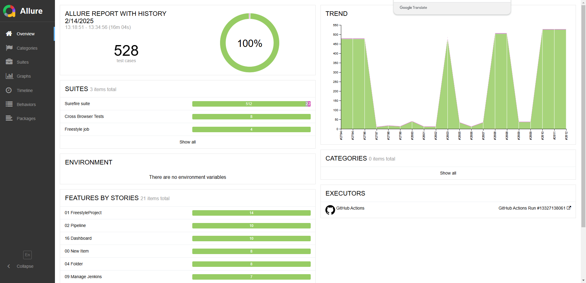

<h1 align="center">Playwright Project for Testing the Magento Software</h1>

<p align="center">
  
  
  
  
  
  
  
  
  
</p>

<p align="center">
<a href="https://valiantsin2021.github.io/Playwright_ProjectJS_2024"> Last run Allure report</a>
</p>

This project is a Playwright-based testing framework for the Magento software testing board.

## Tech Stack
<p align="center">
  
</p>
<p align="center">
  
  
  
  
  
</p>

## Prerequisites

- Node.js (version 22 or higher)
- npm (version 9 or higher)
- Docker (optional, for running tests in a containerized environment)

## Project Setup

1. **Clone the repository to your machine:**
   ```sh
   git clone <repository-url>
   ```

2. **Navigate to the project root folder:**
   ```sh
   cd Playwright_ProjectJS_2024
   ```

3. **Install dependencies:**
   ```sh
   npm ci
   ```

4. **Install Playwright browsers:**
   ```sh
   npx playwright install
   ```
**Reporters**

Allure reporter with previous runs history is used to generate test reports.

Accessibility reports are generated using val-a11y plugin.

Lighthouse reports are generated using @cypress-audit/lighthouse plugin.

CI pipeline is executed on GitHub Actions and test results are uploaded to Allure report and hosted on GitHub pages. - [Project report](https://valiantsin2021.github.io/Playwright_ProjectJS_2024)

____
<a id="allureReport"></a>
##  Allure Report Example

<p align="center">
<a href="https://valiantsin2021.github.io/Playwright_ProjectJS_2024"> Last run Allure report</a>
</p>

<p align="center">
  
</p>

## Project Structure

The project is structured as follows:

- **`package.json`**: Contains project metadata and dependencies.
- **`playwright.config.js`**: Playwright configuration file.
- **`jsconfig.json`**: JavaScript configuration file.
- **`tsconfig.json`**: TypeScript configuration file.
- **`eslint.config.js`**: ESLint configuration file.
- **`prettier.json`**: Prettier configuration file.
- **`Dockerfile`**: Docker image definition file.

- **`tests`**: Directory containing test scripts.
- **`test-results`**: Directory for storing test results.
- **`report`**: Directory for storing test reports.
- **`page_objects`**: POM (Page Object Model) directory.
- **`helpers`**: Utility functions and constants directory.
- **`.hooks`**: Pre-commit hooks directory.
- **`.github`**: GitHub configuration directory.

## Project scripts

The project comes with a set of scripts that can be used to run tests, generate reports, and clean reports and downloads folders. 

## Running Tests

### Locally

1. **Run tests:**
   ```sh
   npm run test
   ```

2. **Generate test report:**
   ```sh
   npm run report
   ```
3. View the test report: https://valiantsin2021.github.io/Playwright_ProjectJS_2024
### Using Docker

1. **Build and run Docker container:**
   ```sh
   docker build -t playwright-java:1.51.1.8 ./helpers
   docker run -it --rm --ipc=host -v "${PWD}:/app" -w /app playwright-java:1.51.1.8
   ```

## Additional Commands

- **Clean reports and downloads folders:**
  ```sh
  npm run clean
  ```

- **Format the code:**
  ```sh
  npm run format
  ```

- **Lint the code:**
  ```sh
  npm run lint
  ```
### Static Code Analysis, Formatting, and Pre-commit Hooks Setup

This project uses ESLint and Prettier for static code analysis and formatting, along with pre-commit hooks to ensure code quality.

**ESLint**

ESLint is configured to use the following plugins:
- `eslint-config-prettier`: Disables ESLint rules that might conflict with Prettier.
- `eslint-plugin-playwright`: Lints tests.

You can run ESLint with the following command:
```sh
npm run lint
```

ESLint rules can be configured in `eslint.config.mjs` file

**Prettier**

Prettier is used for code formatting. It is configured to run on various file types including JavaScript, TypeScript, and JSON files.

You can format your code with the following command:
```sh
npm run format
```

Prettier rules can be configured in `.prettierrc.json` file

**Pre-commit Hooks**

Pre-commit hooks are set up using lint-staged to run ESLint and Prettier on staged files before committing. This ensures that only properly linted and formatted code is committed.

** To add hooks - copy the contents of the .hooks directory to .git/hooks

On commit the staged code will be automatically formatted and linted. Commit will not be finished if there are linting errors found.

The configuration in package.json is as follows:

```json
"lint-staged": {
  "**/*.+(cjs|js|ts|tsx)": [
    "eslint --fix"
  ],
  "**/*.+(cjs|js|ts|json)": [
    "prettier --cache --write"
  ]
}
```

**Commitlint**

Commitlint (https://commitlint.js.org/) is used to enforce conventional commit messages. It is configured to use the @commitlint/config-conventional preset. 

Rules: https://commitlint.js.org/reference/rules 

Common types according to commitlint-config-conventional can be:

- build
- chore
- ci
- docs
- feat
- fix
- perf
- refactor
- revert
- style
- test
- 
These can be modified by your own configuration.

**Usage**

- Linting: ```npm run lint```
- Formatting: ```npm run format```
- Pre-commit hooks: Automatically run on git commit

## Important Notes

- **Attention!** Students are not allowed to install any libraries, plugins, etc., to avoid changing configuration files.
- Ensure you have the necessary permissions to run Docker commands if you choose to use Docker.

## Project Structure

- **/tests**: Contains all test files.
- **/page_objects**: Contains page objects for the project.
- **/helpers**: Contains utilities and constants for the project.
- **/report**: Contains generated test reports.

## Contributing

If you wish to contribute to this project, please follow the standard GitHub flow:

1. Fork the repository.
2. Create a new branch (`git checkout -b feature-branch`).
3. Make your changes.
4. Commit your changes (`git commit -m 'Add some feature'`).
5. Push to the branch (`git push origin feature-branch`).
6. Open a pull request.

## License

This project is licensed under the MIT License.

## Author

Valentin Lutchanka